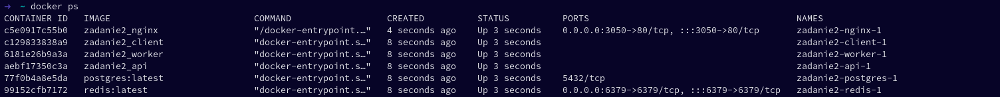

Budowanie i uruchamianie usługi w wersji deweloperskiej:
```ssh
docker compose -f docker-compose.dev.yml build
docker compose -f docker-compose.dev.yml up
```

Usługi działają:


Ekran aplikacji po wprowadzeniu kolejno liczb 2 oraz 4:
