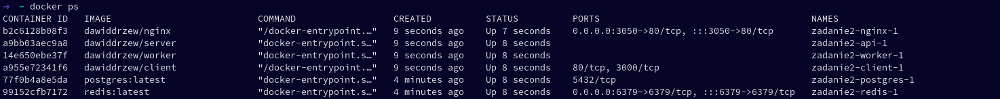

Do budowania obrazów można wykorzystać dołączony skrypt `build-all.sh`:
```
./build-all.sh
```

Następnie usługę można uruchomić za pomocą polecenia:
```
docker compose up
```

Wykorzystywane obrazy pochodzą z DockerHub:


Ekran aplikacji po wprowadzeniu kolejno liczb 1 oraz 5:
