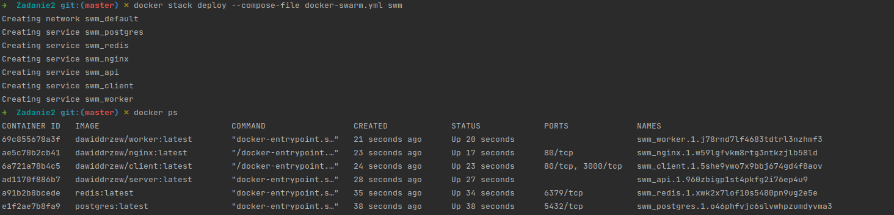

Aplikację można uruchomić w klastrze za pomocą polecienia:
```
docker stack deploy --compose-file docker-swarm.yml swm
```

Usługa działa na klastrze:


Zasady konfiguracji:
- Wszystkie usługi są restartowane w przypadku niepowodzenia
- Baza danych i Redis znajdują się w węźle o roli manager i nie podlegają replikacji
- Baza danych wymaga 32 MB pamięci RAM